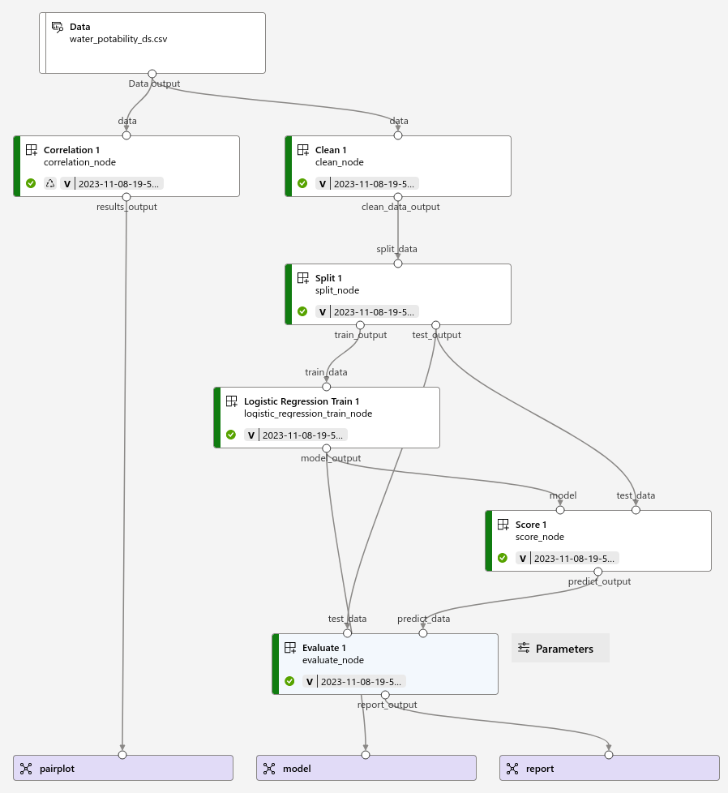
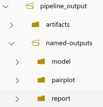

# ucb_mlc_mod4_trabajo_2

Integrantes:
- Arteaga Sabja, Juan Armando.
- Bellido Santa María, José Boris.
- Poleyn Paz, Herwig Luk.

Se han desarrollado los siguientes componentes:
- **clean_component**: Limpia los datos.
  * inputs:
    + data (uri_file): Ruta del archivo con los datos para limpiar.
    + method (string): Método de limpieza (mean=Rellena con la Media los datos faltantes, delete=Elimina las filas con datos faltantes). Por defecto mean.
  * outputs:
    + clean_data_output (uri_file): Ruta del archivo con los datos limpios.
- **split_component**: Divide los datos.
  * inputs:
    + split_data (uri_file): Ruta del archivo con los datos para dividir.
    + split_test_rate: Proporción de los datos usados para la prueba. Por defecto 0.2.
  * outputs:
    + train_output(uri_file): Ruta del archivo con los datos para entrenamiento.
    + test_output(uri_file): Ruta del archivo con los datos para prueba.
- **description_component**: Da información sobre los datos.
  * inputs:
    + data(uri_file): Ruta del archivo con los datos para obtener información.
  * outputs:
    + info_output(uri_file): Ruta del archivo con la información de los datos.
    + describe_output(uri_file): Ruta del archivo con estadísticos de los datos.
- **correlation_component**: Calcula la correlación entre las variables.
  * inputs:
    + data(uri_file): Ruta del archivo con los datos para obtener la correlación.
    + method(string: Método de correlación (pearson, kendall, spearman). Por defecto pearson.
    + color_palette(string): Paleta de colores para las gráficas (PiYG, PRGn, BrBG, PuOr, RdGy, RdBu, RdYlBu, RdYlGn, Spectral, coolwarm, bwr, seismic). Por defecto coolwarm.
    + style(string): Estilo de las gráficas (classic, fast, ggplot). Por defecto ggplot.
  * outputs:
    + results_output(uri_folder): Ruta del directorio con los archivos matrix.csv, matrix.jpg y pairplot.jpg.
- **decission_trees_train_component**: Aplica el entrenamiento aplicando árboles de decisión.
  * inputs:
    + train_data(uri_file): Ruta del archivo con los datos de entrenamiento.
    + objective(string): Variable objetivo. Por defecto Potability.
    + criterion(string): Criterio (gini, entropy, log_loss). Por defecto entropy.
    + min_samples_split(number): Cantidada mínima de para dividir cada nodo. Por defecto 3.
    + max_depth(number): Porfundidad máxima. Por defecto 4.
  * outputs:
    + model_output(uri_file): Ruta del archivo con el modelo entrenado.
- **logistic_regression_train_component**: Aplicar el entrenamiento aplicando regresión logística.
  * inputs:
    + train_data(uri_file): Ruta del archivo con los datos de entrenamiento.
    + objective(string): Variable objetivo. Por defecto Potability.
  * outputs:
    + model_output(uri_file): Ruta del archivo con el modelo entrenado.
- **score_component**: Evalúa los resultados del modelo.
  * inputs:
    + model(uri_file) Ruta del archivo con el modelo.
    + test_data(uri_file): Ruta del archivo con los datos de prueba.
    + objective(string): Variable objetivo. Por defecto Potability.
  * outputs:
    + predict_output(uri_file): Ruta del archivo con los datos obtenidos por el modelo.
- **evaluate_component**: Califica el modelo.
  * inputs:
    + test_data(uri_file): Ruta del archivo con los datos de prueba.
    + predict_data(uri_file): Ruta del archivo con los datos obtenidos por el modelo.
    + objective(string): Variable objetivo. Por defecto Potability.
    + target_name(string): Nombre para el reporte.
  * outputs:
    + report_output(uri_file): Ruta del archivo con el reporte de la calificación del modelo.

Se elaboró un pipeline que permite predecir usando la regresión logistica, el mismo se ejecutó correctamente en Azure, como se puede ver a continuación:

Los resultados se descargaron del directorio pipeline_output:

La explicación del proyecto se encuentra en este [vídeo](https://1drv.ms/v/s!AnYb6RX9jHJcipkfk3pZfSXM2jiuSg?e=HQwSVD)
